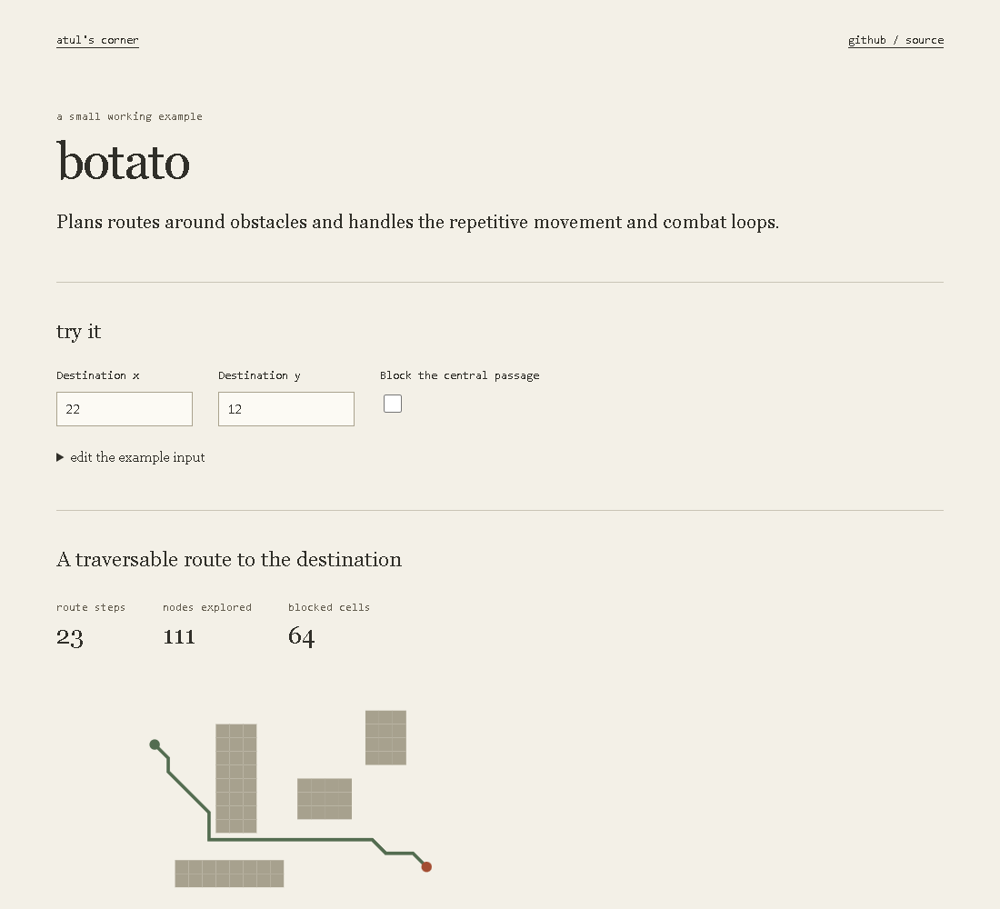

# botato

Plans routes around obstacles and handles the repetitive movement and combat loops.

<!-- working-example:start -->
## Try it in a minute

**[Live example](https://lolstar123.github.io/botato-navigation/)** · [Example code](examples/portfolio/model.mjs) · [Run locally](examples/portfolio/README.md) · [Atul's website](https://atul-kanodia-fieldnotes.atulswaggalicious.chatgpt.site)

Add obstacles, move the destination and recompute an A* route without cutting corners.



<!-- working-example:end -->

## The project

Read the current terrain and target, choose a traversable route and advance along it. If an obstacle changes the route, recalculate before moving; navigation feeds the wider automation loop.

Getting somewhere is easy until the straight line goes through a wall.

## Find your way around

| Path | What is here |
| --- | --- |
| [examples/portfolio](examples/portfolio) | Runnable browser example and fixtures |
| [model.mjs](examples/portfolio/model.mjs) | Actual calculation or workflow |
| [model.test.mjs](examples/portfolio/model.test.mjs) | Reproducible checks and edge cases |
| [PROVENANCE.md](PROVENANCE.md) | How this example relates to the full project |
| [AGENTS.md](AGENTS.md) | Instructions for extending the example |

## Quick start

```sh
python -m http.server 8000 --directory examples/portfolio
node --test examples/portfolio/model.test.mjs
```

Open http://localhost:8000. No dependencies, accounts or API keys needed.

## What is included

A standalone grid planner. No game process, memory bridge or account is required.
