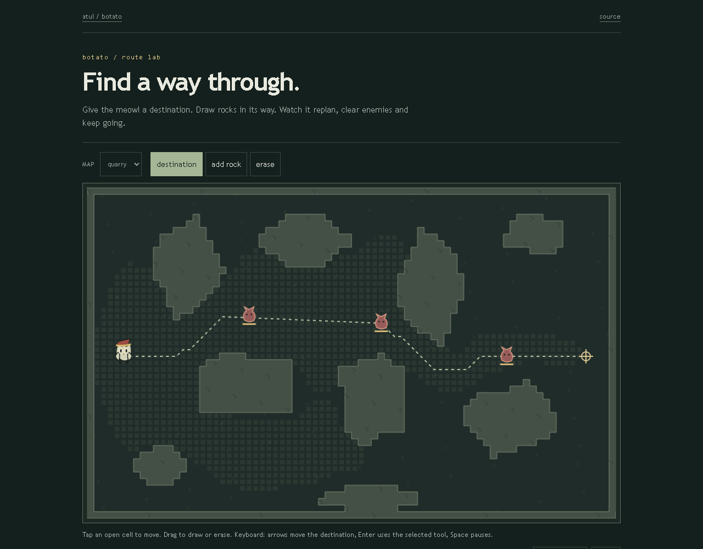

# Botato route lab

[**Open the navigation sandbox**](https://lolstar123.github.io/botato-navigation/) ? [Desktop project](https://poetato.app)

An editable navigation and combat simulation. Give a red-capped meowl a destination, draw obstacles in its way, and watch it recalculate its route. Enemies interrupt movement when they enter range; the meowl clears them and continues.



## Try it

- Choose **quarry**, **ravine** or **ruins**, then tap an open destination.
- Select **add rock** and drag across the route. Select **erase** to reopen a passage.
- Seal the destination to see an unreachable state. The agent stops instead of following an invalid path.
- Pause the simulation to edit the terrain at your own pace. Open **route settings** to change preferred wall clearance or show the search area.
- Export the terrain, raw and smoothed routes, search result and current enemy state as JSON.

The map is keyboard accessible: arrow keys move the destination, Enter applies the selected destination/rock/erase tool, and Space pauses or resumes. The clearance is a preference, so a necessary narrow corridor can still be used.

## How the route is built

The [original C# router](reference/Pathfinder.cs) combines distance from walls with eight-direction A*. The [original smoother](reference/PathSmoother.cs) checks proposed shortcuts for collisions and limits their additional cost.

The browser model follows the same stages on an **80 ? 50** authored terrain. It uses an orthogonal wall-distance field, a Euclidean search heuristic and a 3% smoothing-cost tolerance. Diagonal corner cuts are rejected. Changing occupancy triggers a new search before movement continues.

The enemy encounter loop is a public sandbox illustration of navigation feeding combat. It has three authored enemies, range checks, health and a clear/resume transition. It does not claim to reproduce every production combat decision. Neither the terrains nor the actors are exports from a running game.

## Run locally

Use Python 3 and a current browser. No application dependencies, account or build step are needed.

```sh
python -m http.server 8000 --directory examples/portfolio
```

Open **http://localhost:8000** from this repository directory.

## Checks

```sh
node --test examples/portfolio/model.test.mjs
python -m pip install playwright
python -m playwright install chromium
python tools/browser_audit.py
```

Node checks collision-free routes on all maps, blocked and unreachable destinations, corner-cut prevention and occupancy edits. The isolated headless browser checks movement, automatic combat, map changes, draw/erase, keyboard editing, pause, export and a 390 px viewport. Reduced motion removes decorative bobbing while route movement remains visible. On Windows the audit uses installed Google Chrome; other platforms use Playwright Chromium.

Screenshots are saved to ignored `output/qa/`; the README preview is refreshed by the audit. Search timings are measured in that browser run and are not performance promises.

## Code map

| File | Responsibility |
| --- | --- |
| [model.mjs](examples/portfolio/model.mjs) | Terrain, wall distance, A*, collision checks and smoothing |
| [app.mjs](examples/portfolio/app.mjs) | Canvas drawing, terrain input, movement, combat and export |
| [reference](reference) | Original C# navigation sources |
| [browser_audit.py](tools/browser_audit.py) | Desktop/mobile flows and screenshot evidence |
| [PROVENANCE.md](PROVENANCE.md) | Source relationship and sandbox boundaries |
| [DESIGN.md](DESIGN.md) | Map-first design and accessibility decisions |

The C# references depend on the full desktop project and are not a standalone build. This repository's browser has no game-memory, account or operating-system input integration.
